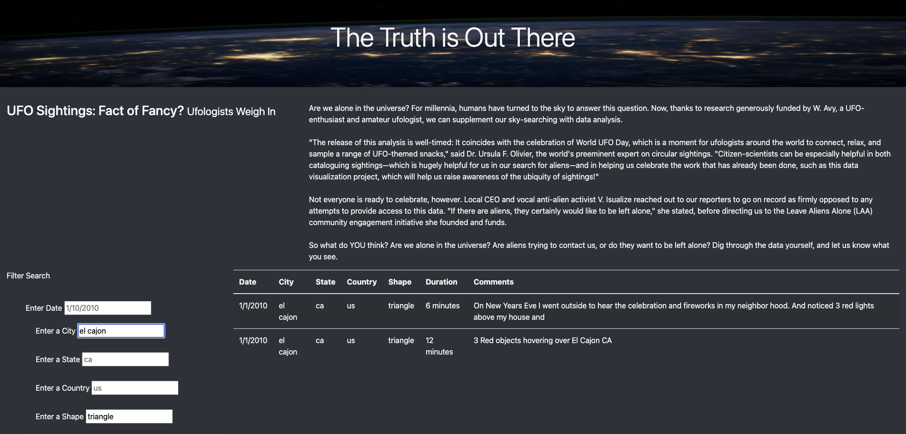

# UFOs-

Overview of Project: 
This project looked at creating ai webpage with a table containing UFO sighting data. Filters have been applied to make data search on the website pretty simple based on search criteria such as date, city, state, country and shape. Tools used included HTML, Javascript, E6+, Bootstrap, D3 and CSS. Data source was from the file data.js

Results: 
The users on the website can filter the data in the table by the filter criteria made available. Below is a sample filter for the city of "el cajon" and shape "triangle".

Summary: 

Drawback  

One drawback is users have to be mindful of the case sensitivity of Javascript when making their userinputs on the website so as to get the required results.

Recommendations for further development.

1. One recommendation will be to have dropdown selections for the filters such as the Country, State and Shape which will make it easier for users to make inputs given the search criteria.

2. Another recommendation will be to show the count of the filtered results whenever a filter is applied.
